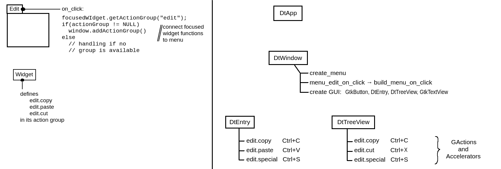

Summary
=============
This project is is reference implementation for how an (application) menu 
can be built up automatically depending on the currently focused widget.

Detailed
========
This project shows how to connect menu items and certain actions of widgets 
without the widgets specifically knowing about the menu. 

If certain actions in the menu are not supported by the widget, they
 will be disabled (sensitivity = NULL).
 
Correctness
===========
I'm not a professional GTK dev, so there might be insuffincies within the 
program. I tried to do my best to create a congruent application, though.
 
Remarks
========

- This example is incomplete:
  It shows the menu "Edit" with items Copy/Cut/Paste. Enabling / Disabling 
  items is only based on "is action supported by widget". It does not take into
  account, if there is really something to copy/cut/paste available
  
- This example is incomplete2:
   Even though the used GtkTextView supports cut/copy/paste, the menu shows 
   only disabled items. This is because this example only cares about `GAction`s
   and `GActionGroup`s. A complete program should also take pure signals into
   account.

Program Architecture
====================
