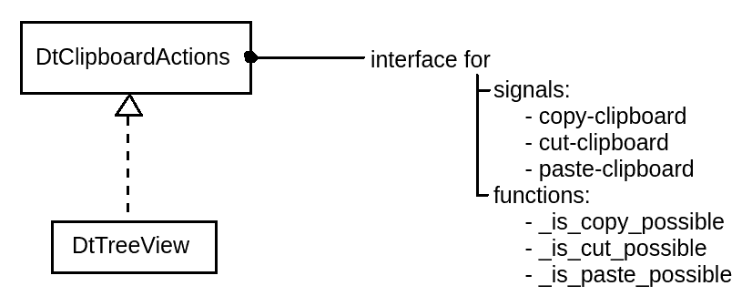

Summary
=============
This project is is reference implementation for how you could 
implment the menu items copy/cut/paste.

In it's heart it...

- ... uses GMenu
- ... updates menu content only on click (implemented through the 
        `submenu-action` attribute of GMenuItem s
- ... priorizes accels for focused widgets over global ones
- ... uses `DtClipboardActions` for clipboard related actions

Compile
========
You should be able to compile through

    sh ./compile_all.sh

How to test?
=============

- Run program
- Change focused widget and...
  - Use Accelerators: 
    - Ctrl+C
    - Ctrl+X
    - Ctrl+V
    - Ctrl+S
  - Use the edit menu

Reference points
=================
- All non-standard actions are logged inside the console.
- `DtEntry` shows how to register accelerators .
  - No other fancy stuff here, so good to get an overview.
- 
  - `DtTreeView` is an example implementation of the `DtClipboardAction` 
    interface. It allows only `copy` and `cut` (check the greyed out 
    `paste` item of the menu).
- `DtMenuMgr` is not a class. It's a set of functions, that do all the
  menu handling (setup menu, setup accels, provide default callbacks for 
  copy/cut/paste). It's purpose it to not pollute the `dtwindow` files.

Correctness
===========
I'm not a professional GTK dev, so there might be insuffincies within the 
program. 
 
